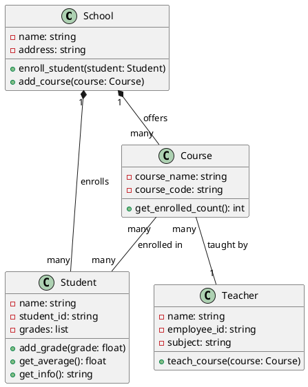
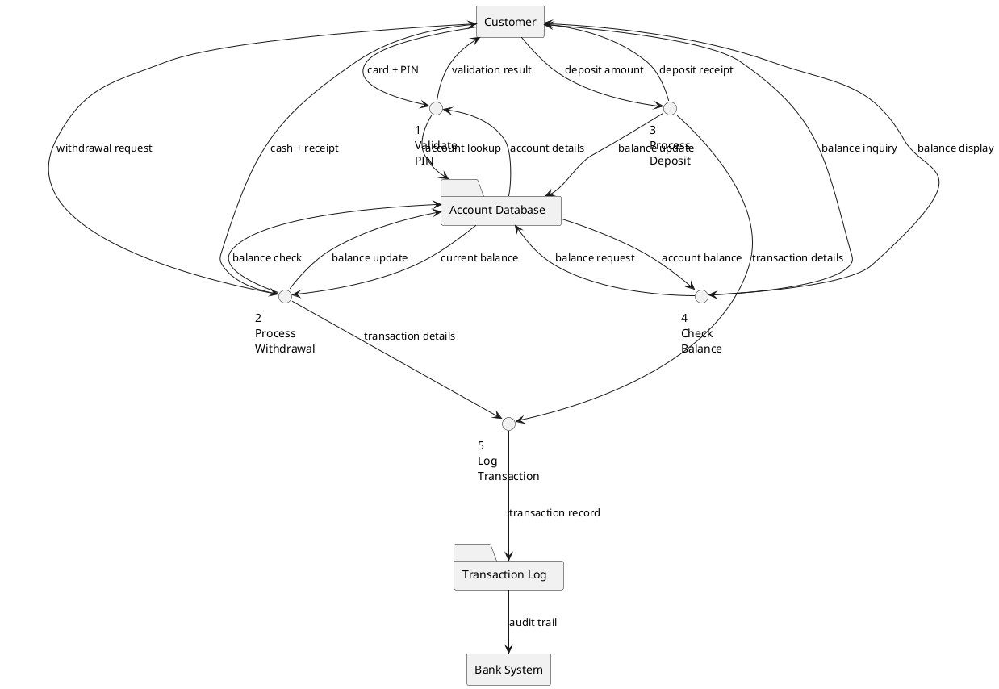
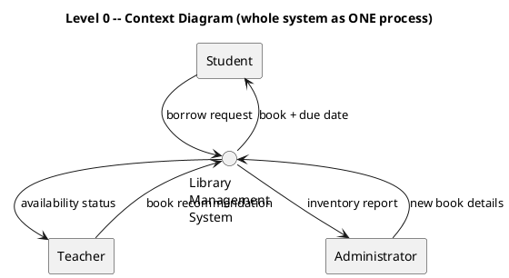
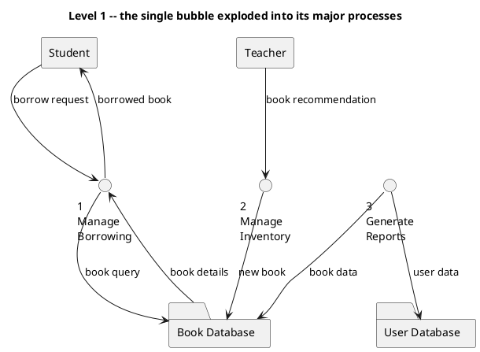
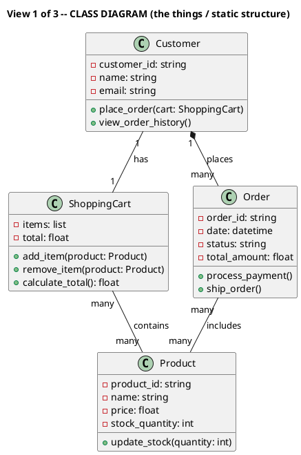
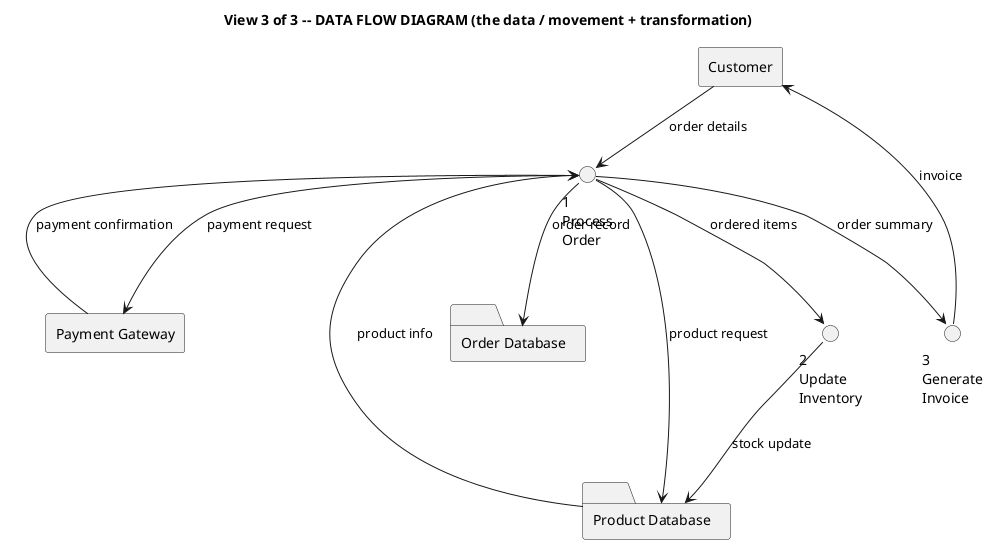

# Supplementary Materials

Diagram listings for this episode. Nothing here is spoken in the audio — it's the
read-along reference. Every diagram is described in full in the narration; these are the
written-out notations so you can redraw them. Class diagrams and DFDs are written in
PlantUML; the structure chart is an indented ASCII tree.

### Listing 1 — Class diagram: a School system (composition + association + multiplicity)


### Listing 2 — Structure chart: a Library Management System (functional decomposition as a tree)
```text
Library Management System
├── User Management
│   ├── Add Member
│   ├── Remove Member
│   └── Update Member Info
├── Book Management
│   ├── Add Book
│   ├── Remove Book
│   └── Search Books
└── Lending Operations
    ├── Borrow Book
    ├── Return Book
    └── Calculate Fines
```

### Listing 3 — Data flow diagram: an ATM (Level 1 — processes, data stores, external entities, labelled flows)


### Listing 4 — Level 0 (context) then Level 1 DFD for a Library (the zoom-in)




### Listing 5 — The online-shopping system in all three views (the capstone)


```text
View 2 of 3 -- STRUCTURE CHART (the jobs / functional decomposition)

Online Shopping System
├── Customer Management
│   ├── Register Customer
│   ├── Authenticate User
│   └── Update Profile
├── Product Catalog
│   ├── Browse Products
│   ├── Search Products
│   └── View Product Details
├── Shopping Cart
│   ├── Add to Cart
│   ├── Remove from Cart
│   └── Calculate Total
└── Order Processing
    ├── Process Payment
    ├── Update Inventory
    └── Generate Invoice
```



## Glossary
| Term | Expansion | Meaning |
|---|---|---|
| DFD | Data Flow Diagram | A model showing how data moves between processes, stores and external entities |
